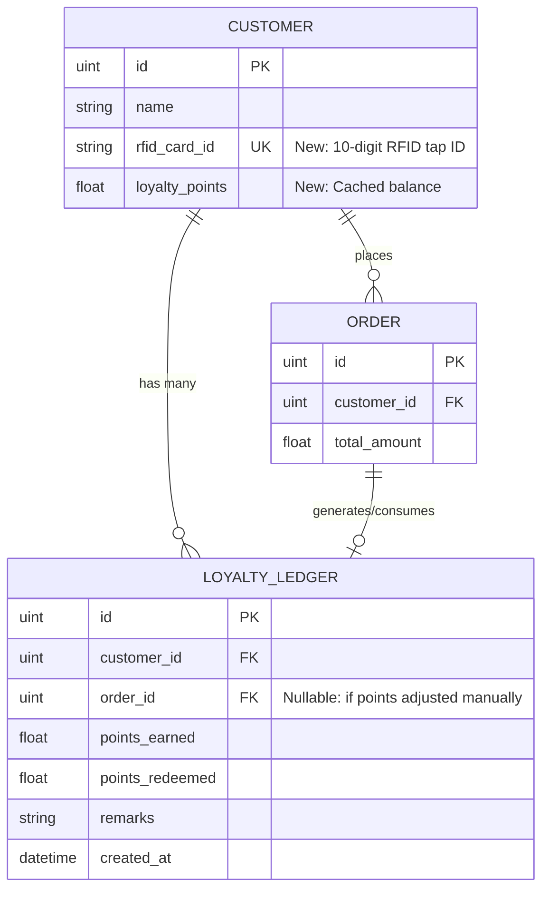
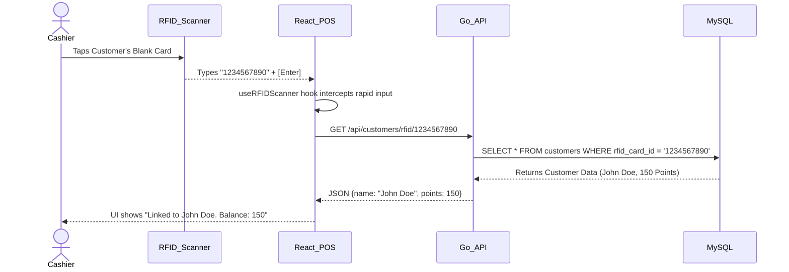
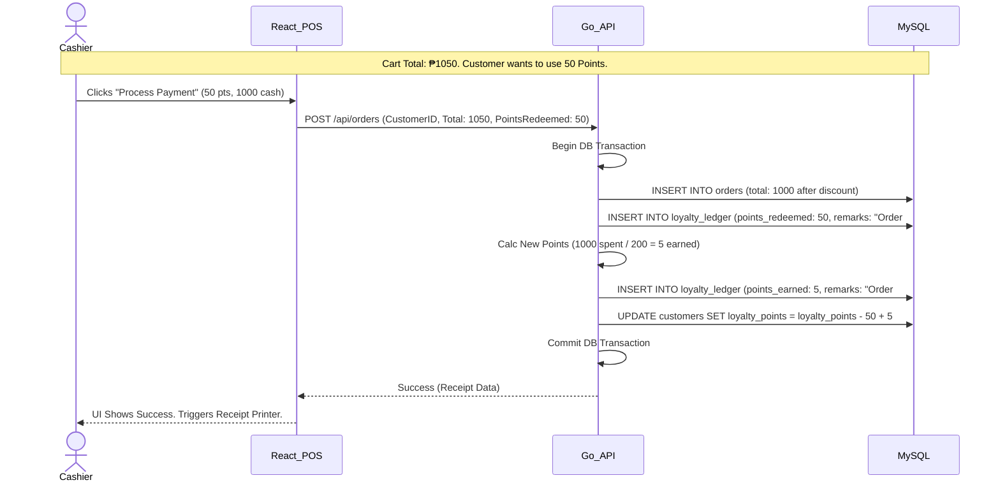

# RFID Loyalty Points System (SMSytem)

This document outlines the technical implementation plan to introduce a CR80 RFID-based Loyalty Points System into your Go/React `SMSytem` project.

## 1. System Architecture & Context

The physical USB 13.56MHz RFID Scanner acts as a **Keyboard Emulator**. It requires no drivers. When a card is tapped, the scanner types the card's 10-digit ID and fires the `Enter` key. Our React frontend will capture this keystroke sequence globally or via a hidden input to trigger backend requests.

### Entity Relationship Diagram (ERD)

---

## Proposed Changes

### Go Backend (Models & Database)

We will use GORM to update the schema and automatically migrate the new structures in MySQL.

#### [MODIFY] `backend/internal/models/customer.go`
- Add `RFIDCardID string` column (Indexed, Unique).
- Add `LoyaltyPoints float64` column (Caching the total points to avoid calculating the ledger on every scan).

#### [NEW] `backend/internal/models/loyalty_ledger.go`
- Create the `LoyaltyLedger` struct representing the point-in/point-out ledger logic to ensure auditable point tracking.

### Go Backend (API & Handlers)

#### [MODIFY] Checkout/Transaction Handler
- Update the existing checkout logic. If a `CustomerID` is attached to the cart, the system will apply the business logic (e.g., `TotalAmount / 200 = points`).
- Insert an entry into the `LoyaltyLedger`.
- If the customer chose to "Pay with Points" (`payment_method = 'points'`), deduct the points from the ledger and apply a discount to the Order total.

#### [NEW] `backend/internal/handlers/loyalty_handler.go`
- `GET /api/customers/rfid/:rfid_card_id` -> API to instantly fetch customer details (Name, Points Balance) when a card is tapped.

### React Frontend (POS Checkout UI)

#### [NEW] `frontend/src/hooks/useRFIDScanner.ts`
- A custom React hook that attaches a `keydown` event listener to the `window`. It will accumulate rapid keystrokes. If it detects 10 digits followed rapidly by an `Enter` key (within ~100ms), it recognizes it as an "RFID Tap" rather than human typing, and fires a callback holding the Card ID.

#### [MODIFY] POS Checkout Screen (e.g., `Checkout.tsx`)
- Implement the `useRFIDScanner` hook.
- When `onScan(cardId)` fires, execute a GET request to the backend.
- **UI Updates**:
  1. Show a banner: "Loyalty Card Detected: [Customer Name] - Balance: [Points]".
  2. In the payment modal, add a "Redeem Points" button that pulls from the customer's balance to reduce the cart total.

---

## 2. Interaction Workflows

### Scenario A: Customer Scans Card to Check/Link Profile

### Scenario B: Customer Earns and Redeems Points on an Order

