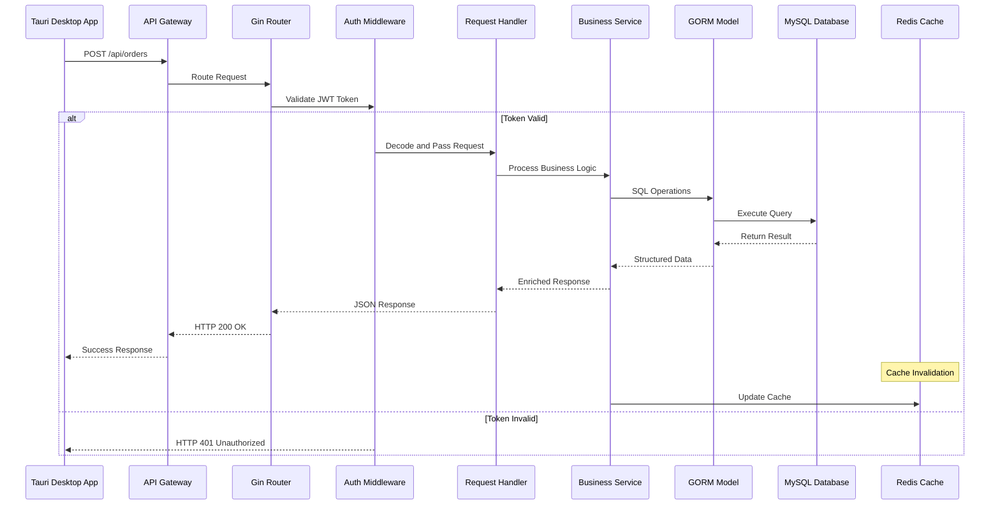
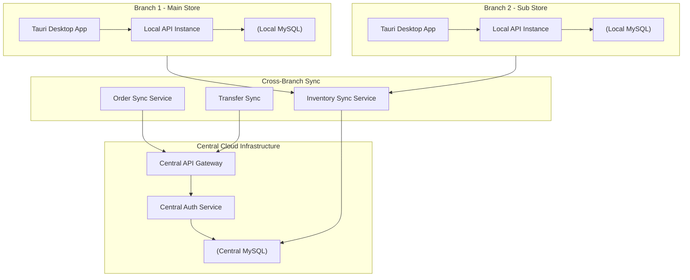
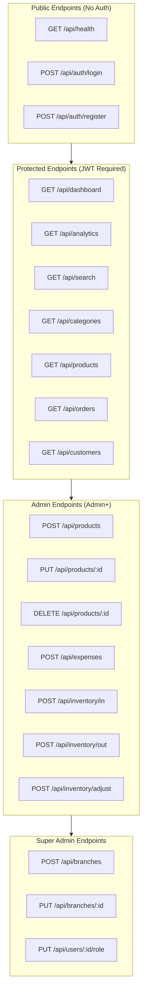
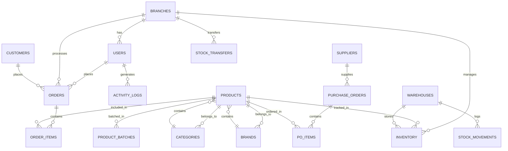

# SMSystem Enterprise Architecture

```mermaid
%%{init: {'theme': 'base', 'themeVariables': { 'primaryColor': '#3b82f6', 'primaryTextColor': '#fff', 'primaryBorderColor': '#1d4ed8', 'lineColor': '#6b7280', 'secondaryColor': '#10b981', 'tertiaryColor': '#f59e0b'}}}%%

flowchart TB
    subgraph CLIENT["CLIENT LAYER (Tauri Desktop)"]
        direction TB
        
        subgraph FRONTEND["React + TypeScript Frontend"]
            direction LR
            PAGES["Pages Layer"]
            COMP["Components Layer"]
            CONTEXT["State Management"]
            API["Axios HTTP Client"]
            
            PAGES --> COMP --> CONTEXT --> API
        end
        
        subgraph TAURI["Tauri Runtime"]
            direction LR
            WINDOW["Window Manager"]
            IPC["Tauri IPC Bridge"]
            NATIVE["Native APIs"]
            
            WINDOW --> IPC --> NATIVE
        end
        
        FRONTEND --> TAURI
    end

    subgraph EDGE["EDGE / GATEWAY LAYER"]
        direction TB
        
        subgraph LOADBALANCER["Reverse Proxy / Load Balancer"]
            direction LR
            NGINX["Nginx"]
            CACHE["Redis Cache Layer"]
            RATE["Rate Limiter"]
            
            NGINX --> CACHE --> RATE
        end
        
        subgraph APIGATEWAY["API Gateway"]
            direction LR
            ROUTER["Gin Router"]
            MIDDLEWARE["Middleware Stack"]
            VALIDATOR["Request Validator"]
            
            ROUTER --> MIDDLEWARE --> VALIDATOR
        end
        
        LOADBALANCER --> APIGATEWAY
    end

    subgraph SERVER["BACKEND LAYER (Go + Gin)"]
        direction TB
        
        subgraph HANDLERS["Handler Layer"]
            direction LR
            
            subgraph CORE["Core Business Handlers"]
                AUTH["Auth Handler"]
                ORDER["Order Handler"]
                PROD["Product Handler"]
                INV["Inventory Handler"]
                CUST["Customer Handler"]
            end
            
            subgraph EXPANSION["Extended Handlers"]
                EXP["Expense Handler"]
                PO["Purchase Order Handler"]
                TRANS["Transfer Handler"]
                BRANCH["Branch Handler"]
                USER["User Handler"]
            end
            
            subgraph ANALYTICS["Analytics and Reporting"]
                DASH["Dashboard Handler"]
                ANALYTICS["Analytics Handler"]
                REPORT["Report Handler"]
                SEARCH["Search Handler"]
            end
            
            subgraph SYSTEM["System Handlers"]
                CAT["Category Handler"]
                BRAND["Brand Handler"]
                SUP["Supplier Handler"]
                TERM["Terminal Handler"]
                LOG["Log Handler"]
                SYS["System Handler"]
            end
            
            CORE --> EXPANSION --> ANALYTICS --> SYSTEM
        end
        
        subgraph SERVICES["Service Layer"]
            direction LR
            
            subgraph BUISNESS["Business Services"]
                AUTH_SVC["Auth Service"]
                INV_SVC["Inventory Service"]
                ORDER_SVC["Order Service"]
                PAY_SVC["Payment Service"]
            end
            
            subgraph UTILITY["Utility Services"]
                LOG_SVC["Log Service"]
                PRINT_SVC["Printer Service"]
                TERM_SVC["Terminal Service"]
            end
            
            BUISNESS --> UTILITY
        end
        
        subgraph MODELS["Model / Data Layer"]
            direction LR
            
            subgraph DOMAIN["Domain Models"]
                USER_M["User Model"]
                ORDER_M["Order Model"]
                PROD_M["Product Model"]
                CUST_M["Customer Model"]
                INV_M["Inventory Model"]
            end
            
            subgraph ENTITIES["Entity Models"]
                BRANCH_M["Branch Model"]
                EXPENSE_M["Expense Model"]
                PO_M["Purchase Order"]
                TRANS_M["Transfer Model"]
                BATCH_M["Batch Model"]
            end
            
            DOMAIN --> ENTITIES
        end
        
        HANDLERS --> SERVICES --> MODELS
    end

    subgraph DATA["DATA LAYER"]
        direction TB
        
        subgraph STORAGE["Storage Systems"]
            direction LR
            MYSQL["(MySQL 8.0)"]
            VOL["Docker Volumes"]
            BACKUP["Backup Service"]
            
            MYSQL --> VOL --> BACKUP
        end
        
        subgraph CACHE_LAYER["In-Memory Cache"]
            direction LR
            REDIS["(Redis Cache)"]
            SESSION["Session Store"]
            
            REDIS --> SESSION
        end
        
        STORAGE <--> CACHE_LAYER
    end

    subgraph SECURITY["SECURITY LAYER"]
        direction TB
        
        subgraph AUTH_SEC["Authentication"]
            direction LR
            JWT["JWT Token"]
            BCRYPT["bcrypt Hash"]
            SALT["Password Salt"]
            
            JWT --> BCRYPT --> SALT
        end
        
        subgraph PERMS["Authorization"]
            direction LR
            RBAC["RBAC Matrix"]
            ROLES["Role Definitions"]
            PERM["Permission Guard"]
            
            RBAC --> ROLES --> PERM
        end
        
        subgraph ENCRYPT["Data Encryption"]
            direction LR
            TLS["TLS/SSL"]
            ENV["Environment Secrets"]
            AES["AES Encryption"]
            
            TLS --> ENV --> AES
        end
        
        AUTH_SEC --> PERMS --> ENCRYPT
    end

    subgraph INFRA["INFRASTRUCTURE"]
        direction TB
        
        subgraph CONTAINER["Container Orchestration"]
            direction LR
            DOCKER["Docker Engine"]
            COMPOSE["Docker Compose"]
            SWARM["Docker Swarm"]
            
            DOCKER --> COMPOSE --> SWARM
        end
        
        subgraph DEPLOY["Deployment Pipeline"]
            direction LR
            CI["CI/CD GitHub Actions"]
            BUILD["Build and Test"]
            PUBLISH["Release and Publish"]
            
            CI --> BUILD --> PUBLISH
        end
        
        subgraph HOST["Host Environment"]
            direction LR
            UBUNTU["Ubuntu VPS"]
            CLOUD["Cloud Provider"]
            LOCAL["Local Development"]
            
            UBUNTU --> CLOUD --> LOCAL
        end
        
        CONTAINER --> DEPLOY --> HOST
    end

    CLIENT --> EDGE
    EDGE --> SERVER
    SERVER --> DATA
    SERVER <--> SECURITY
    INFRA --> SERVER
    
    classDef frontend fill:#3b82f6,stroke:#1d4ed8,stroke-width:2px,color:#fff
    classDef backend fill:#10b981,stroke:#047857,stroke-width:2px,color:#fff
    classDef database fill:#f59e0b,stroke:#b45309,stroke-width:2px,color:#fff
    classDef security fill:#ef4444,stroke:#b91c1c,stroke-width:2px,color:#fff
    classDef infra fill:#8b5cf6,stroke:#6d28d9,stroke-width:2px,color:#fff
    
    class FRONTEND,TAURI frontend
    class HANDLERS,SERVICES,MODELS backend
    class DATA,STORAGE,CACHE_LAYER database
    class SECURITY,AUTH_SEC,PERMS,ENCRYPT security
    class INFRA,CONTAINER,DEPLOY,HOST infra
```

---

## Data Flow Architecture



---

## Multi-Branch Architecture



---

## Module Dependency Graph

```mermaid
flowchart TB
    subgraph CORE["Core Dependencies"]
        AUTH["Auth Module"]
        USER["User Module"]
        BRANCH["Branch Module"]
    end
    
    subgraph BUSINESS["Business Modules"]
        ORDER["Order Module"]
        PRODUCT["Product Module"]
        CUSTOMER["Customer Module"]
        INVENTORY["Inventory Module"]
    end
    
    subgraph SUPPORT["Support Modules"]
        EXPENSE["Expense Module"]
        PO["Purchase Order Module"]
        TRANSFER["Transfer Module"]
    end
    
    subgraph ANALYTICS["Analytics Modules"]
        DASHBOARD["Dashboard Module"]
        REPORT["Report Module"]
        ANALYTICS["Analytics Module"]
    end
    
    subgraph MASTER["Master Data"]
        CATEGORY["Category Module"]
        BRAND["Brand Module"]
        SUPPLIER["Supplier Module"]
        SETTINGS["Settings Module"]
    end
    
    AUTH --> USER
    AUTH --> BRANCH
    USER --> ORDER
    USER --> PRODUCT
    USER --> CUSTOMER
    
    ORDER --> INVENTORY
    PRODUCT --> INVENTORY
    CUSTOMER --> ORDER
    
    ORDER --> EXPENSE
    INVENTORY --> PO
    INVENTORY --> TRANSFER
    
    ORDER --> DASHBOARD
    INVENTORY --> DASHBOARD
    CUSTOMER --> DASHBOARD
    EXPENSE --> DASHBOARD
    
    DASHBOARD --> REPORT
    DASHBOARD --> ANALYTICS
    
    PRODUCT --> CATEGORY
    PRODUCT --> BRAND
    PO --> SUPPLIER
    USER --> SETTINGS
```

---

## API Endpoint Architecture



---

## Entity Relationship Diagram



---

## Technology Stack Summary

| Layer | Technology | Version | Purpose |
|-------|------------|---------|---------|
| **Frontend** | React | 18.x | UI Framework |
| **Language** | TypeScript | 5.x | Type Safety |
| **Styling** | TailwindCSS | 3.x | Utility CSS |
| **Desktop** | Tauri | 2.x | Native Desktop App |
| **Backend** | Go | 1.21+ | API Server |
| **Framework** | Gin | Latest | HTTP Router |
| **Database** | MySQL | 8.0 | Primary Data Store |
| **ORM** | GORM | Latest | Database Abstraction |
| **Auth** | JWT | - | Token-based Auth |
| **Container** | Docker | Latest | Containerization |
| **CI/CD** | GitHub Actions | - | Automated Releases |

---

## System Capabilities Matrix

| Feature | Status | Description |
|---------|--------|-------------|
| Multi-Branch Support | Active | Centralized + Distributed deployment |
| Role-Based Access Control | Active | 4-tier permission system |
| Real-time Inventory | Active | Stock tracking with batch tracking |
| Purchase Order Management | Active | Auto-generate POs from low stock |
| Stock Transfer Between Branches | Active | Inter-branch inventory sync |
| POS Integration | Active | Terminal payment processing |
| Analytics Engine | Active | Natural language query support |
| CRM Features | Active | Customer tracking and stats |
| Expense Tracking | Active | Per-branch expense logging |
| Daily/Weekly Reports | Active | Automated report generation |
| Activity Logging | Active | Complete audit trail |
| Database Backup | Active | Automated daily backups |
| Cross-Platform Desktop | Active | Windows, macOS, Linux |

---

*Generated: March 2026*
*System Version: v1.0.7*
*Architecture: Microservices-ready Monolith*
